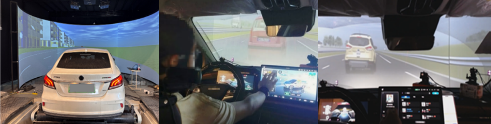

# DATAD: Driver Attention in Takeover of Autonomous Driving

<div align="center">
  
</div>

## Overview

**DATAD** (Driver Attention in Takeover of Autonomous Driving) is a dataset specifically designed for human-machine interaction research in autonomous driving. It supports our  paper, **_From Gaze to Movement: Predicting Visual Attention for Autonomous Driving Human-Machine Interaction based on Programmatic Imitation Learning_**.

The dataset captures driver gaze behavior, operational inputs, and surrounding traffic dynamics during emergency takeovers. It is collected from **60 participants** across **12 types of takeover scenarios** and includes approximately **600,000 frames** of gaze point data.

This dataset provides insights into driver attention allocation, which is essential for enhancing autonomous vehicle safety and human-machine interaction strategies.


## Features
- **Large-scale dataset**: Nearly 600,000 frames covering driver gaze behavior, with synchronized instance segmentation and RGB visual data, enabling detailed scene understanding in takeover scenarios.
- **High-fidelity simulation**: Collected using CARLA-based driving simulators
- **Comprehensive driving context**: Includes gaze data, vehicle control inputs, and surrounding traffic information
- **Emergency scenarios**: Captures real-time driver reactions to critical events
- **Rich metadata**: Position, velocity, acceleration, and yaw angle of surrounding vehicles


## Dataset Examples

### 🧪 Data Collection Platform Description


To ensure the authenticity of gaze data, all takeover scenarios in this dataset were conducted on a real-vehicle-based driving simulation platform. As shown in the images above, the platform integrates a full-scale real vehicle with an immersive surround projection system, providing participants with highly realistic visual and operational feedback. The setup includes:

Real Vehicle Platform: As shown in the top-left image, we built a four-wheel dynamometer testbed with adjustable wheelbase, enabling compatibility with real vehicles of different brands and sizes. Since the driver operates an actual vehicle ("real car in loop"), the use of a genuine steering wheel, accelerator, and brake pedals ensures high fidelity in driving interaction (including rollable wheels).

Surround Projection System: The driving environment is rendered in CARLA and projected onto a large-angle curved screen, creating an immersive and realistic visual experience. As shown in the second and third images on the left, the virtual scenes faced by the driver closely resemble real road environments.

Remote Eye-Tracking System: As shown in the third image, a contactless remote eye tracker is installed inside the cabin. It records gaze point coordinates continuously at 60 Hz and also captures physiological metrics such as eyelid openness and pupil diameter.


The figure above shows our eye movement attention acquisition process flow. By inputting foreground images (transformed through image processing into relative positional relationships between vehicles in the foreground), traffic flow information, driver's current gaze point, and operational data, we output high-level eye movement actions and their corresponding probabilities (LEFT, RIGHT, STAY). Through sampling, these are converted into low-level actions (actual gaze point coordinates), which are then used to generate heatmaps.

### ✅ Qualitative Comparison

As shown in figure above, we visualize the gaze prediction results across three critical frames in an urban driving scenario involving a sudden vehicle intrusion from the right. Our model, PILOT, demonstrates strong consistency with the ground truth by accurately capturing the driver's gaze shift from the forward-looking position (Frame #195) to the intruding vehicle (Frame #205). Compared to baseline methods, PILOT maintains sharper focus and better temporal consistency. In contrast, models such as DRIVE and PGnet tend to exhibit dispersed attention or delayed reactions. DBVM sometimes overemphasizes non-salient distant regions, while DR(eye)VE often fixates on central or static objects, missing dynamic threats. These observations highlight the superiority of PILOT in modeling attention transitions in real-time, safety-critical scenes.


## 🔥Update

- **2024/05**: We uploaded some simulation code for traffic scenarios to facilitate interested researchers in conducting experimental replications.

- **2024/04**: We uploaded all experimental data of one participant, primarily available on Hugging Face.


## 📖Repository Structure

```
DATAD-main/
├── DATA/                   # Main dataset (not included here due to large size)
│   ├── Tester1/
│   ├── Tester2/
│   └── ...                 # Up to Tester10
├── Script/                 # Python scripts for data processing and visualization
│   ├── visualize_gaze.py
│   └── ...
├── Scene_ICCV/             # Simulation and data collection code (see details below)
│   ├── asset/                  # Images and other resource files
│   ├── Gazing_point_program/   # Gaze point related programs
│   ├── log_data/               # Directory for log data storage
│   ├── carla_data/             # Carla simulation related data
│   ├── __pycache__/            # Python bytecode cache folder (can be ignored)
│   ├── TTF/                    # Font files (e.g., SimSun.ttf, used by pygame)
│   ├── sensor_script/          # Scripts related to various sensors
│   ├── sensor/                 # Sensor configuration and implementation
│   ├── agents/                 # Agent-related code
│   ├── check_IS/               # Checking/evaluation scripts
│   ├── vehicle_method.py       # Core classes for vehicle methods and window display
│   ├── Feel_drive.py           # Main program for driving experience
│   ├── Scene1-01.py            # Simulation script for Scene 1-01
│   ├── Scene1-02.py            # Simulation script for Scene 1-02
│   ├── Set_info.py             # Information collection and recording
│   ├── config01.py             # Configuration file for Scene 1-01
│   ├── config02.py             # Configuration file for Scene 1-02
│   ├── Set_sensor.py           # Sensor setup and pygame rendering
│   ├── disposition.py          # Vehicle and environment arrangement scripts
│   ├── replay.py               # Simulation replay script
│   ├── Set_taskpoint.py        # Task point setup script
│   ├── Set_ARHUD.py            # AR-HUD (Augmented Reality Head-Up Display) setup
│   ├── Set_request.py          # Request setup script
│   └── README.md               # Brief description file
├── README.md
└── LICENSE
```

> 💾 Due to storage limitations, the full dataset (~40 GB per subject) is not hosted in this repository.  
> You can download individual subjects' data at:  
> 👉 https://huggingface.co/datasets/OOParts/DATAD

---

## 2. Data Format

Each subject's folder (e.g., `Tester1/`) contains:
- **Gaze Data**: Eye-tracking coordinates, timestamps, fixation durations
- **Driving Data**: Steering angles, brake and accelerator positions, speed
- **Traffic Context**: Surrounding vehicle positions, velocities, and object categories
- **Semantic Segmentation Maps**: Instance-labeled foreground objects
  
- The RGB images have not been uploaded due to their large file size. If you would like to access the image data, please contact us by opening an issue.
---

## 3. Using the Dataset

Download the dataset and you can directly use it by reading readme in each filefold.


## License

This dataset is released under the MIT License. See `LICENSE` for details.
